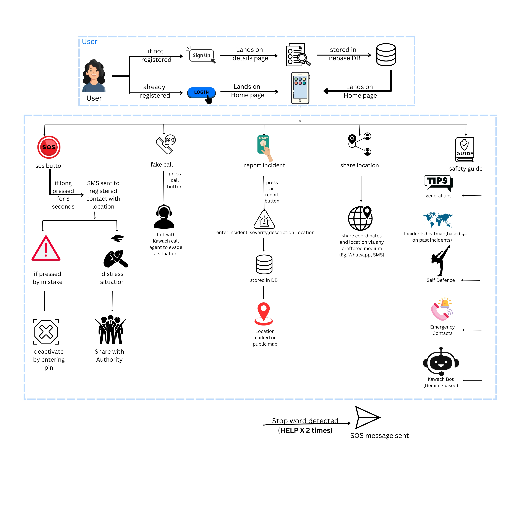

# Kawach - Women Safety Application

<p align="center">
  
</p>


## Overview

Kawach is a comprehensive women safety application designed to provide immediate assistance and emergency response features. The app offers real-time location tracking, emergency SOS alerts, and safe route navigation to help women feel more secure while traveling.

## Features

- **Emergency SOS Alert**: Quick access to send distress signals to emergency contacts with location details
- **Live Location Tracking**: Share real-time location with trusted contacts
- **Safe Route Navigation**: Suggests safer routes based on crowd density and lighting conditions
- **Emergency Services Integration**: Direct connection to nearby police stations and helplines
- **Voice-Activated SOS**: Trigger emergency alerts through voice commands
- **Offline Support**: Core safety features work without internet connectivity


## System Architecture

<p align="center">
  
</p>

The application follows a microservices architecture with the following components:
- Frontend Mobile Application (Flutter)
- Real-time Location Service
- Emergency Response System
- Database Layer (Firebase)

## Installation

```bash
# Clone the repository
git clone [repository-url]

# Navigate to the project directory
cd kawach

# Install dependencies
flutter pub get

# Run the application
flutter run
```

## Technical Requirements

- Flutter SDK ≥ 3.0.0
- Dart ≥ 2.17.0
- Android SDK ≥ 23
- iOS ≥ 11.0

## Configuration

1. Create a `config.dart` file in the `lib/config` directory
2. Add your API keys and endpoints:

```dart
class Config {
  static const String API_BASE_URL = 'your-api-url';
  static const String MAPS_API_KEY = 'your-maps-api-key';
}
```


## License

This project is licensed under the MIT License - see the [LICENSE](LICENSE) file for details

## Developed By
- [Tejas Gadge ](https://github.com/tejasgadge2504)
- [Anisha Shankar](https://github.com/hahaanisha)


